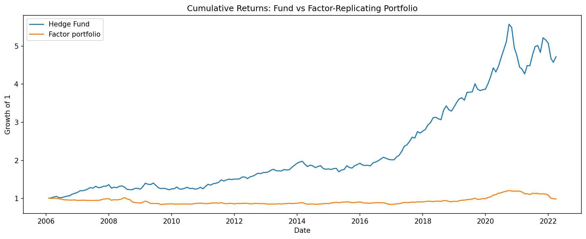
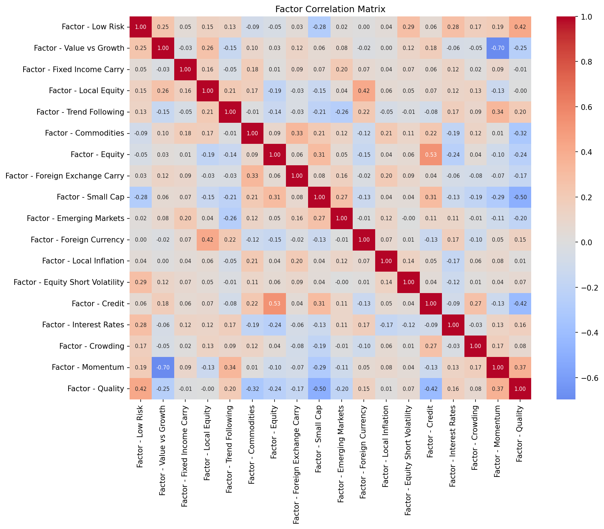
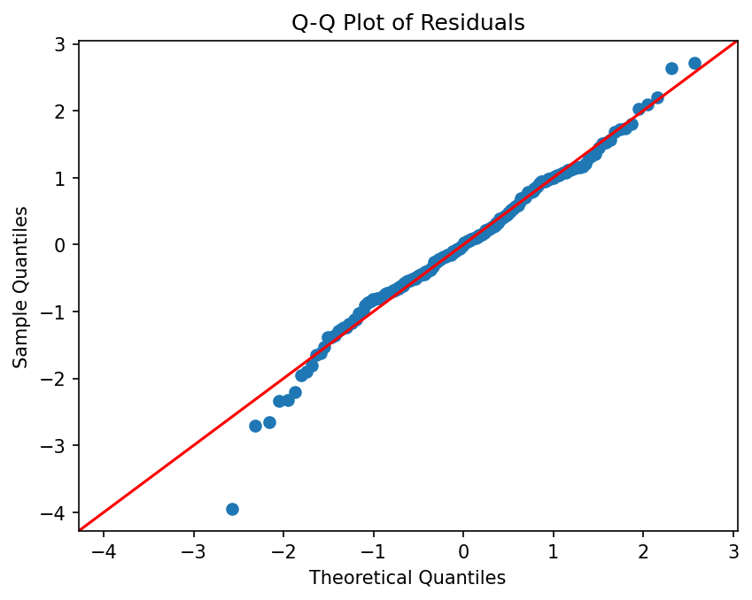
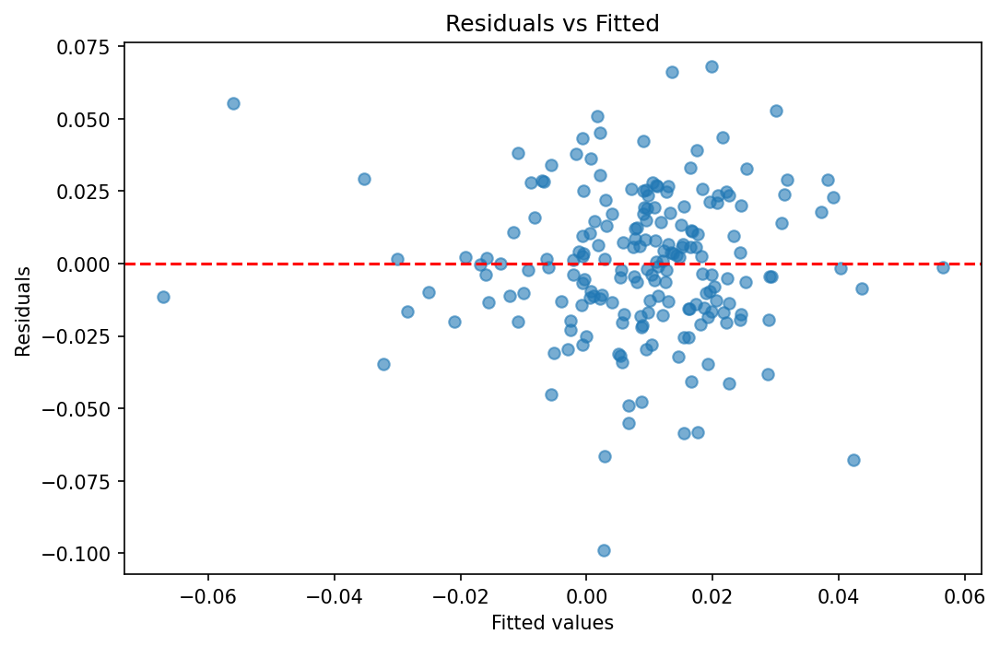
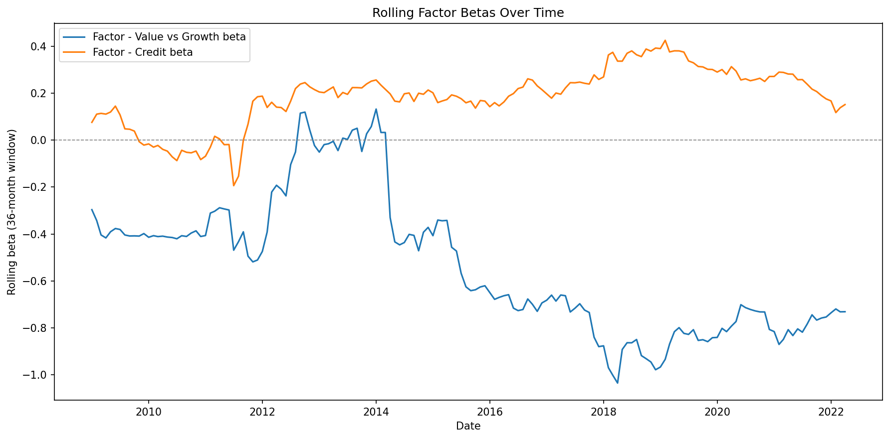

# Hedge Fund Factor Exposure & Risk Analysis

**Can a hedge fund's returns be replicated by its systematic factor exposures, and are those exposures stable over time?**

This project decomposes 16 years of monthly hedge fund returns into factor exposures and manager alpha. It tests whether the regression's assumptions hold, compares the fund's risk profile with a portfolio that replicates its factor exposures, and checks whether those exposures drift over time.

## Key findings

- **Most of the fund's return comes from manager skill, not factor exposure.** Monthly alpha is 0.83% (about 10% annualised, p < 0.001), while two factors explain only 28% of return variance.
- **Replicating the factors doesn't replicate the performance.** The fund's Sharpe ratio is 0.99, compared with 0.02 for the factor-replicating portfolio.
- **Lower volatility doesn't mean lower risk.** The factor portfolio is less volatile (5.4% vs 10.3% annualised) but has much fatter tails (excess kurtosis 3.96 vs 0.64) and stronger negative skew.
- **The fund's exposures drift over time.** Rolling betas are non-stationary (ADF p = 0.58 and 0.36), so historical betas are an unreliable guide to future risk.



---

## Data

195 monthly observations (Jan 2006 – Mar 2022) of a single hedge fund's returns alongside 18 systematic factor return series: Value vs Growth, Credit, Momentum, Quality, Low Risk, Equity, Local Equity, Small Cap, Emerging Markets, Trend Following, Commodities, Interest Rates, Fixed Income Carry, FX Carry, Foreign Currency, Local Inflation, Equity Short Volatility and Crowding.

The raw dataset is not included in this repository.

## Project structure

```
├── data_cleaning.py     DataCleaner class: data quality checks and fixes
├── factor_analysis.py   FactorModel and StrategyAnalysis classes: regression, diagnostics, risk comparison
├── figures/             Charts saved by factor_analysis.py
├── requirements.txt
└── .gitignore
```

## Method

### 1. Data cleaning (`data_cleaning.py`)

Checking the data before modelling turned up four issues:

| Issue | Resolution |
|---|---|
| 2018 and 2019 date blocks out of chronological order | Sorted chronologically; confirmed all 195 months present with no gaps or duplicates |
| Extreme outliers in `Value vs Growth` and `Interest Rates` (~10⁶ too large) | Found with z-score and IQR scans and identified as a units/scaling error, since genuine monthly returns can't exceed ±100%. Rescaled by 10⁶ |
| 24 leading zeros in `Crowding` (Jan 2006 – Dec 2007) | Treated as missing data from before the factor was tracked, not as genuine zero returns, and converted to NaN |
| Two zero-return months in the fund series | Inspected and kept as plausible flat months in low-volatility periods |

### 2. Factor selection

- **Multicollinearity:** all variance inflation factors (VIFs) are below 3.5, so no serious collinearity.
- **Relevance screening:** univariate correlations with fund returns, plus a cross-validated Lasso on standardised factors.
- **Specification comparison:** four candidate models were compared. The two-factor model (**Value vs Growth, Credit**) matched the explanatory power of the larger specifications, and the extra factors were not statistically significant.

Momentum had the second-highest raw correlation with the fund, yet it was insignificant in every model that included Value vs Growth. The two factors are strongly negatively correlated (≈ −0.7), so Momentum adds little information once Value vs Growth is in the model. This is why factors were not selected on correlation alone.



### 3. Final model

OLS with HAC (Newey-West) standard errors:

| Term | Coefficient | p-value |
|---|---|---|
| Alpha (const) | 0.0083 | < 0.001 |
| Value vs Growth | −0.590 | < 0.001 |
| Credit | 0.154 | 0.012 |

R² = 0.282 (adjusted 0.274). The model is jointly significant (HAC-robust F-test p < 0.001).

### 4. Diagnostics

| Test | Result | Implication |
|---|---|---|
| Jarque-Bera / Q-Q plot | Non-normal residuals (JB p = 0.002; kurtosis 4.05 vs 3 for a normal), driven by a fat left tail | Default standard errors may be unreliable |
| Durbin-Watson | ≈ 1.69 | Mild positive autocorrelation |
| Breusch-Pagan / residuals vs fitted | p = 0.989 | No evidence of heteroscedasticity |

Because of the non-normality and autocorrelation, inference uses HAC standard errors. Both factors stay significant under them.

<p float="left">
  
  
</p>

### 5. Fund vs factor-replicating portfolio

The replicating portfolio is the model's fitted returns with the intercept removed. It captures the fund's systematic exposure without the alpha.

| | Fund | Factor portfolio |
|---|---|---|
| Sharpe ratio (annualised, rf = 0) | **0.985** | 0.017 |
| Annualised volatility | 10.3% | 5.4% |
| Max drawdown | −23.4% | −18.0% |
| Downside deviation | 6.4% | 4.6% |
| Skew | −0.25 | −0.99 |
| Excess kurtosis | 0.64 | 3.96 |

The fund takes more conventional risk but is well compensated for it. The factor portfolio looks safer on volatility, but its tails are fatter and it earns almost no return for that tail risk.

### 6. Stability of exposures

36-month rolling regressions estimate how each beta changes over time. An Augmented Dickey-Fuller (ADF) test is then run on each beta series:

| Factor | ADF statistic | p-value | Stationary? |
|---|---|---|---|
| Value vs Growth | −1.398 | 0.583 | No |
| Credit | −1.839 | 0.361 | No |



Neither exposure reverts to a stable mean, which suggests style drift. For risk monitoring, the full-sample betas describe the past, not a reliable forecast.

---

## Limitations and next steps

- **Informal ADF test:** adjacent 36-month windows share 35 observations, so the rolling betas are autocorrelated by construction. The test agrees with the visible drift in the rolling-beta plot, but it should be read as supporting evidence rather than a formal result.
- **Zero risk-free rate:** Sharpe ratios assume rf = 0. Using a T-bill series would lower both figures, and the fund's lead would remain.
- **Only two factors:** the conclusion applies to this model. A richer factor set might replicate more of the return.
- **Planned extensions:** a regime-switching or Kalman-filter model of time-varying betas; historical and parametric VaR/ES for the fund against the replicating portfolio; and stress tests on the largest drawdown periods.

## Running the project

```bash
python -m venv venv
venv\Scripts\activate          # Windows
source venv/bin/activate       # macOS / Linux
pip install -r requirements.txt

python data_cleaning.py        # expects data.xlsx (sheet "returns data"), writes cleaned_data.csv
python factor_analysis.py      # EDA, factor selection, regression, diagnostics, risk comparison; saves charts to figures/
```

## Tools

Python · pandas · NumPy · statsmodels · scikit-learn · Matplotlib · seaborn

## Use of AI tools

I used Claude as a research and debugging aid. It helped me understand how to apply and interpret VIF, the Breusch-Pagan test, HAC standard errors and the ADF test, and it helped with environment and plotting issues. The analysis, methodology decisions and code are my own.
